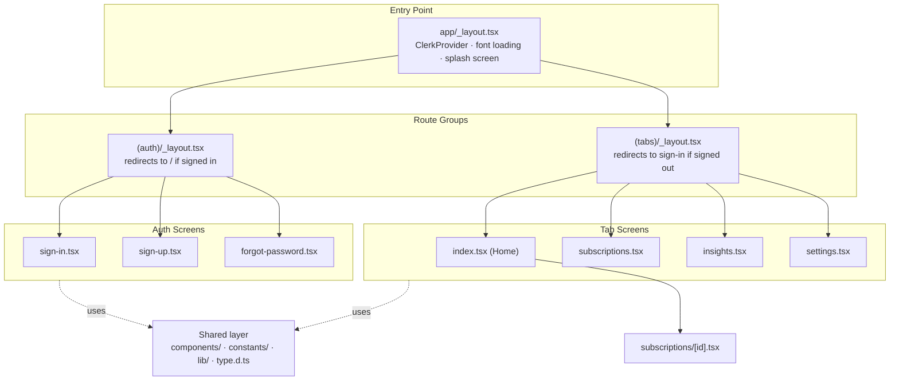
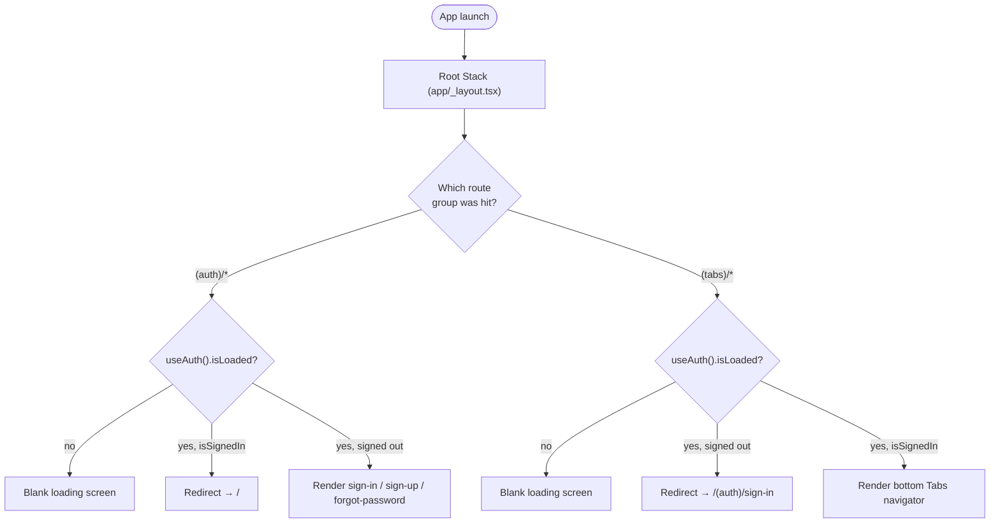
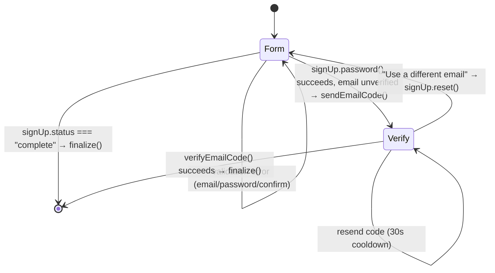
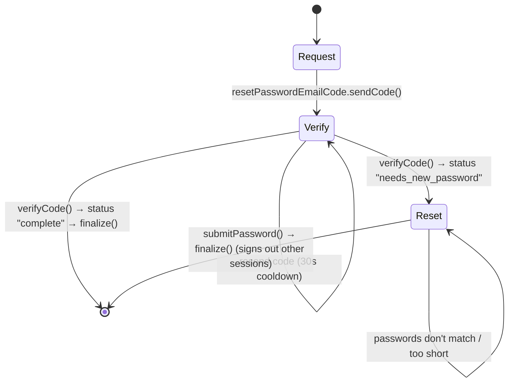
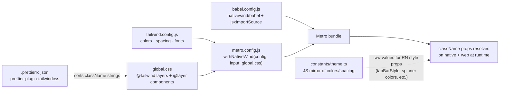
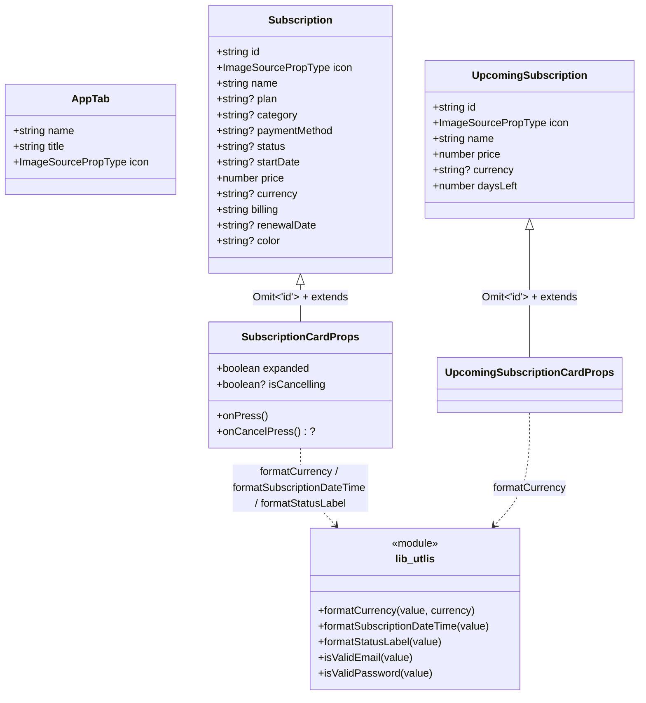

# financial-app

A mobile app built with [Expo](https://expo.dev) and [Expo Router](https://docs.expo.dev/router/introduction/) for tracking personal finances and subscriptions. Styled with [NativeWind](https://www.nativewind.dev/) (Tailwind CSS for React Native) and authenticated with [Clerk](https://clerk.com/).

> The working brand name is **"Finly"** (`constants/auth.ts`), and `app.json` now carries that same name (`Finly` / `financial-app`) — the app config and code are in sync.

## Tech Stack

| Area                | Technology                                                                      |
| ------------------- | ------------------------------------------------------------------------------- |
| Framework           | [Expo](https://expo.dev) `~54.0.36` (New Architecture enabled)                  |
| Runtime             | React `19.1.0`, React Native `0.81.5`                                           |
| Routing             | Expo Router `~6.0.24` (file-based, typed routes)                                |
| Navigation          | React Navigation (bottom tabs + native stack, via Expo Router)                  |
| Authentication      | [Clerk](https://clerk.com/) (`@clerk/expo`) — email/password, email-code verify |
| Styling             | NativeWind `^4.2.7` + Tailwind CSS `^3.4.19`                                    |
| Language            | TypeScript `~5.9.2` (strict mode)                                               |
| Animations/Gestures | react-native-reanimated, react-native-gesture-handler, react-native-worklets    |
| Linting/Formatting  | ESLint `^9.25.0` (`eslint-config-expo`, flat config) + Prettier `^3.9.8`        |
| Date formatting     | [dayjs](https://day.js.org/) (used in `lib/utlis.ts`)                           |
| Class merging       | [clsx](https://github.com/lukeed/clsx) (conditional NativeWind class strings)   |

There is no charting/graphing library in `package.json` yet (no Victory, react-native-svg-charts, d3, etc.) — the **Insights** tab (`app/(tabs)/insights.tsx`) is a placeholder screen, so spending charts/graphs are not implemented yet. The diagrams in this README are architecture/flow diagrams (Mermaid), not app UI.

## Prerequisites

- Node.js and npm
- A [Clerk](https://clerk.com/) application, with `EXPO_PUBLIC_CLERK_PUBLISHABLE_KEY` available (see [Environment Variables](#environment-variables))
- Expo Go app (for testing on a physical device) or an iOS/Android simulator

## Getting Started

```bash
npm install
npm run start       # opens Expo Dev Tools / Metro bundler
npm run ios         # run on iOS simulator
npm run android      # run on Android emulator
npm run web          # run in the browser
npm run lint          # run ESLint via `expo lint`
npm run format         # write Prettier formatting
npm run format:check    # check Prettier formatting without writing
```

There is no test script configured in `package.json`.

## Environment Variables

The root layout (`app/_layout.tsx`) reads `EXPO_PUBLIC_CLERK_PUBLISHABLE_KEY` and throws at startup if it's missing:

```
Missing EXPO_PUBLIC_CLERK_PUBLISHABLE_KEY. Add your key to .env.local.
Run: 1) clerk auth login  2) clerk link  3) clerk env pull — then restart the dev server.
```

`.env` and `.env*.local` are git-ignored (see `.gitignore`), so each developer/environment supplies its own Clerk key.

## Project Structure

```
financial-app/
├── app/                          # Expo Router file-based routes
│   ├── _layout.tsx               # Root layout — ClerkProvider, font loading, splash screen, imports global.css
│   ├── onboarding.tsx            # /onboarding route (placeholder)
│   ├── (auth)/                   # Route group for authentication (segment hidden from the URL)
│   │   ├── _layout.tsx           # Auth stack layout — redirects signed-in users to "/"
│   │   ├── sign-in.tsx           # /sign-in — email + password, links to sign-up & forgot-password
│   │   ├── sign-up.tsx           # /sign-up — password creation + email verification code
│   │   └── forgot-password.tsx   # /forgot-password — request code → verify code → set new password
│   ├── (tabs)/                   # Route group for the main bottom-tab experience
│   │   ├── _layout.tsx           # Tabs layout — redirects signed-out users to sign-in; builds tab bar
│   │   ├── index.tsx             # / (Home) — balance card, upcoming renewals, subscription list
│   │   ├── subscriptions.tsx     # /subscriptions (placeholder)
│   │   ├── insights.tsx          # /insights (placeholder — future charts/graphs live here)
│   │   └── settings.tsx          # /settings — user profile card + sign out
│   └── subscriptions/
│       └── [id].tsx              # /subscriptions/[id] — dynamic route (placeholder detail view)
│
├── assets/
│   ├── fonts/                    # Plus Jakarta Sans family (Light/Regular/Medium/SemiBold/Bold/ExtraBold)
│   ├── icons/                    # Tab bar icons + brand/service icons (spotify, netflix, notion, github, ...)
│   ├── images/                   # App icons, splash screens, avatar, logos, tab icon @2x/@3x variants
│   └── expo.icon/                # Expo icon source assets (SVG/JSON/PNG)
│
├── components/
│   ├── AuthButton.tsx             # Primary auth CTA — label / ActivityIndicator spinner / disabled state
│   ├── AuthTextField.tsx          # Labeled input with inline error + optional right-side action (e.g. "Show")
│   ├── ListHeading.tsx             # Section heading with a "See All" action, used on Home
│   ├── SubscriptionCard.tsx         # Expandable subscription row (Reanimated layout + fade transitions)
│   └── UpcomingSubscriptionCard.tsx  # Compact "renews in N days" card for the horizontal Upcoming list
│
├── constants/
│   ├── auth.ts                    # APP_NAME, APP_TAGLINE, PASSWORD_MIN_LENGTH, RESEND_COOLDOWN_SECONDS
│   ├── data.ts                    # Tab bar config + mock data (HOME_USER, HOME_BALANCE, subscriptions)
│   ├── icons.ts                    # Central import/export map for all icon assets (`icons.home`, ...)
│   ├── images.ts                    # Central import/export map for image assets
│   └── theme.ts                     # Design tokens: colors, spacing scale, derived component sizes
│
├── lib/
│   └── utlis.ts                    # formatCurrency, formatSubscriptionDateTime, formatStatusLabel,
│                                    # isValidEmail, isValidPassword
│
├── global.css                       # Tailwind directives + `@layer components` classes (tabs, home, cards,
│                                     # auth forms, settings, modals, pickers, category chips)
├── type.d.ts                         # Global ambient TypeScript interfaces (no imports needed)
├── image.d.ts                         # Module declarations so .png/.jpg/.jpeg/.svg/.gif imports type-check
├── expo-env.d.ts                       # Auto-generated Expo/TypeScript environment types (git-ignored)
├── nativewind-env.d.ts                  # NativeWind's TypeScript environment types
│
├── app.json                              # Expo app config (name, icon, splash, platform settings, plugins)
├── babel.config.js                        # babel-preset-expo + NativeWind's JSX transform
├── metro.config.js                         # Metro bundler config, wrapped with NativeWind (→ global.css)
├── tailwind.config.js                       # Tailwind theme: content paths, colors, spacing, font families
├── tsconfig.json                             # Extends expo/tsconfig.base; strict mode; `@/*` path alias
├── eslint.config.js                           # Flat ESLint config extending eslint-config-expo
├── .prettierrc.json / .prettierignore          # Prettier config (incl. prettier-plugin-tailwindcss)
├── package.json                                 # Scripts and dependencies
├── .vscode/                                      # Editor settings (Expo extension, format-on-save)
├── .agents/skills/, .claude/skills/               # Installed Clerk skills (git-ignored, see skills-lock.json)
└── .expo/                                          # Local, machine-specific Expo dev-server cache (git-ignored)
```

## Architecture at a Glance



## Routing (Expo Router)

Routing is entirely file-based under `app/`:

- **`app/_layout.tsx`** is the root layout. It wraps everything in `ClerkProvider` (using `EXPO_PUBLIC_CLERK_PUBLISHABLE_KEY` + `tokenCache` for persisted sessions), loads the Plus Jakarta Sans fonts via `useFonts`, hides the splash screen once fonts are ready, imports `global.css` (registering Tailwind/NativeWind globally), and renders a header-less `Stack`.
- **Route groups** — folders wrapped in parentheses, e.g. `(auth)` and `(tabs)` — organize routes without adding a URL segment. Each group has its own `_layout.tsx` that also acts as an **auth gate**:
    - `(auth)/_layout.tsx` calls `useAuth()`; while Clerk is loading it renders a blank `auth-loading-screen`, and once loaded it `<Redirect href="/" />`s away if the user is already signed in — otherwise it renders a header-less `Stack` for `sign-in`, `sign-up`, and `forgot-password`.
    - `(tabs)/_layout.tsx` mirrors that in the opposite direction: while loading it shows the same blank screen, and if the user is **not** signed in it `<Redirect href="/(auth)/sign-in" />`s. Once authenticated, it renders a `Tabs` navigator built by mapping over `tabs` from `constants/data.ts`; the tab bar's visual styling (height, radius, insets, icon frame) comes from `constants/theme.ts`, and `useSafeAreaInsets` keeps it clear of the device's home indicator.
- **Dynamic routes** — `app/subscriptions/[id].tsx` reads the `id` param via `useLocalSearchParams` and resolves any `/subscriptions/<id>` URL.
- **Typed routes** are enabled (`experiments.typedRoutes` in `app.json`), with generated types under `.expo/types/router.d.ts`.

### Auth gating flow



### Current route map

| Path                      | File                             | Auth gate       | Notes                                                                          |
| ------------------------- | -------------------------------- | --------------- | ------------------------------------------------------------------------------ |
| `/`                       | `app/(tabs)/index.tsx`           | signed-in only  | Home tab — balance card, "Upcoming" horizontal list, full subscriptions list   |
| `/subscriptions`          | `app/(tabs)/subscriptions.tsx`   | signed-in only  | Subscriptions tab (placeholder)                                                |
| `/insights`               | `app/(tabs)/insights.tsx`        | signed-in only  | Insights tab (placeholder — intended home for future spending charts/graphs)   |
| `/settings`               | `app/(tabs)/settings.tsx`        | signed-in only  | Shows Clerk user avatar initial, name/email, and a "Sign Out" button           |
| `/subscriptions/[id]`     | `app/subscriptions/[id].tsx`     | signed-in only  | Subscription detail (placeholder — reads `id` via `useLocalSearchParams`)      |
| `/onboarding`             | `app/onboarding.tsx`             | none            | Onboarding screen (placeholder, contains inline notes on Expo Router concepts) |
| `/(auth)/sign-in`         | `app/(auth)/sign-in.tsx`         | signed-out only | Email + password sign-in via Clerk                                             |
| `/(auth)/sign-up`         | `app/(auth)/sign-up.tsx`         | signed-out only | Two-phase: create account → verify emailed 6-digit code                        |
| `/(auth)/forgot-password` | `app/(auth)/forgot-password.tsx` | signed-out only | Three-phase: request code → verify code → set new password                     |

> Most tab screens still render placeholder text (`<Text>Insights</Text>`, etc.) — the navigation shell and auth flow are fully wired ahead of the finance-tracking feature UI (subscriptions list/detail, insights charts) being built out.

## Authentication (Clerk)

Auth is handled by `@clerk/expo` with a password + email-code verification strategy (no OAuth/social sign-in wired up yet). All three auth screens share `AuthButton` and `AuthTextField` for layout/loading/error consistency, and pull copy/config from `constants/auth.ts` (`APP_NAME`, `APP_TAGLINE`, `PASSWORD_MIN_LENGTH = 15`, `RESEND_COOLDOWN_SECONDS = 30`). Client-side email/password checks live in `lib/utlis.ts` (`isValidEmail`, `isValidPassword`); server-side validation errors come back through Clerk's `errors.fields.*` / `errors.global`.

### Sign-up flow



### Forgot-password flow



Sign-up also mounts a `<View nativeID="clerk-captcha" />` — the required anchor for Clerk's bot-protection captcha.

## Styling

Styling uses **NativeWind**, which lets Tailwind utility classes be used directly on React Native components via `className`.

- `tailwind.config.js` scans `app/**` and `components/**` for class usage, and extends Tailwind's theme with the app's color palette (`background`, `foreground`, `card`, `muted`, `primary`, `accent`, `border`, `success`, `destructive`, `subscription`), a custom pixel-based spacing scale, a `4xl` border-radius token, and font-family tokens (`sans`, `sans-light`, `sans-medium`, `sans-semibold`, `sans-bold`, `sans-extra-bold`) mapped to the Plus Jakarta Sans font files.
- `global.css` declares the three Tailwind layers and a large set of reusable component classes (`@layer components`) grouped by feature: tab bar icons, home balance card & lists, subscription/upcoming cards, auth screens (brand block, form fields, buttons, error/success banners), settings screen, and modal/picker/category-chip primitives (defined ahead of the UI that will use them).
- `constants/theme.ts` mirrors the Tailwind color/spacing tokens as plain JS objects (`colors`, `spacing`, `components`) for use in places that need raw style values instead of class names — e.g. `tabBarStyle` in `(tabs)/_layout.tsx` and `placeholderTextColor`/spinner `color` props in the auth components, which React Native requires as literal values rather than class names.
- `metro.config.js` wires NativeWind into Metro's bundler via `withNativeWind(config, { input: './global.css' })`, pointing it at `global.css` as the Tailwind entry point.
- `babel.config.js` adds `babel-preset-expo` with `jsxImportSource: 'nativewind'` plus the `nativewind/babel` preset, so JSX elements pick up NativeWind's styling behavior at compile time.
- `.prettierrc.json` includes `prettier-plugin-tailwindcss`, which sorts `className` strings into Tailwind's canonical order on format.

### Styling config pipeline



## Configuration Files Reference

| File                                   | Purpose                                                                                                                                                                                                                                                   |
| -------------------------------------- | --------------------------------------------------------------------------------------------------------------------------------------------------------------------------------------------------------------------------------------------------------- |
| `app.json`                             | Expo app manifest: app name/slug/version, icon & splash screen, iOS/Android/Web platform config, plugins (`expo-router`, `expo-splash-screen`, `expo-font`, `@clerk/expo`, `expo-secure-store`), and experimental flags (`typedRoutes`, `reactCompiler`). |
| `babel.config.js`                      | Babel presets: `babel-preset-expo` (with NativeWind's JSX import source) and `nativewind/babel`.                                                                                                                                                          |
| `metro.config.js`                      | Extends Expo's default Metro config with NativeWind, using `global.css` as the Tailwind CSS entry point.                                                                                                                                                  |
| `tailwind.config.js`                   | Tailwind theme configuration — content paths, extended color palette, spacing scale, border radius, font family tokens.                                                                                                                                   |
| `tsconfig.json`                        | Extends `expo/tsconfig.base`; strict type-checking; `@/*` path alias resolving to the project root.                                                                                                                                                       |
| `eslint.config.js`                     | Flat ESLint config built on `eslint-config-expo`; ignores `dist/*`.                                                                                                                                                                                       |
| `.prettierrc.json` / `.prettierignore` | Prettier formatting rules plus `prettier-plugin-tailwindcss` for class-name sorting; ignore list for generated/vendor files.                                                                                                                              |
| `.vscode/settings.json`                | Enables format-on-save code actions: fix-all, organize imports, sort members.                                                                                                                                                                             |
| `.vscode/extensions.json`              | Recommends the Expo VS Code extension.                                                                                                                                                                                                                    |
| `skills-lock.json`                     | Lockfile for Clerk skills installed via `npx skills add` into `.agents/skills/` and `.claude/skills/` (both git-ignored).                                                                                                                                 |
| `.gitignore`                           | Excludes `node_modules`, `.expo`, native `ios`/`android` build folders, env files, build artifacts, installed skills, and OS/editor cruft.                                                                                                                |

## Type Declarations

- **`type.d.ts`** — global ambient interfaces used across the app without explicit imports:
    - Navigation: `AppTab`, `TabIconProps`
    - Domain: `Subscription`, `SubscriptionCardProps`, `UpcomingSubscription`, `UpcomingSubscriptionCardProps`, `ListHeadingProps`
    - Auth UI: `AuthTextFieldProps`, `AuthButtonProps`
- **`image.d.ts`** — declares `.png`/`.jpg`/`.jpeg`/`.svg`/`.gif` as importable modules so image imports type-check.
- **`expo-env.d.ts`** — auto-generated by Expo; regenerated on `expo start`/`expo prebuild`, not meant to be hand-edited.
- **`nativewind-env.d.ts`** — NativeWind's ambient types (e.g. `className` prop support on RN components).

## TypeScript

### Why we use it

- **Catches errors at compile time instead of runtime.** In a mobile app, a runtime crash from `undefined.price` means a bad build shipped to a device/store — TypeScript turns that into a red squiggle in the editor before it's ever run.
- **Self-documenting code.** `type.d.ts`'s `Subscription` interface tells you exactly what shape a subscription has without hunting through `constants/data.ts` — the type _is_ the contract.
- **Safe refactoring.** Rename a `Subscription` field and every usage that breaks lights up immediately, across components, screens, and mock data — instead of discovering it at runtime on one specific screen.
- **Editor tooling / DX.** Autocomplete, inline docs, and "go to definition" all depend on the type checker knowing what's in scope.

### How we use it in this project

- **`strict: true`** in `tsconfig.json` (extending `expo/tsconfig.base`) — the strongest safety net TypeScript offers (`strictNullChecks`, `noImplicitAny`, etc. are all on). No opting into looser rules.
- **Global ambient types, not per-file imports.** `type.d.ts` wraps its interfaces in `declare global { ... }` plus a trailing `export {}` (which turns the file into a module so `declare global` is legal). Every `.tsx` file in the project can reference `Subscription` or `AuthButtonProps` directly with zero `import` statements — a deliberate trade-off: convenient everywhere, but the types aren't co-located with the components that use them, so you have to know `type.d.ts` exists.
- **Module declarations for non-code assets.** `image.d.ts` declares `.png`/`.jpg`/`.svg`/etc. as modules so `import icon from './logo.png'` type-checks — without it, TypeScript has no idea what an image import "is."
- **`Omit<T, K>` to derive prop types from domain types**, e.g. `interface SubscriptionCardProps extends Omit<Subscription, 'id'>` — the card doesn't need an `id` prop, so rather than duplicating every other field it strips just that one from the source interface. Same pattern for `UpcomingSubscriptionCardProps`.
- **Optional properties (`?`)** for anything not guaranteed present, e.g. `plan?: string`, `error?: string | null` — forces every consumer to handle the "might not be there" case instead of assuming.
- **Union string literals** for constrained values instead of a bare `string`, e.g. `autoCapitalize?: 'none' | 'sentences' | 'words' | 'characters'` — invalid values are a compile error, not a typo discovered at runtime.
- **Reused RN generic types** instead of re-inventing them, e.g. `inputRef?: React.RefObject<TextInput | null>` and pulling `TextInputProps['autoComplete']` directly off React Native's own prop types so this project's types stay in sync with the library's.
- **Path alias `@/*`** configured in `tsconfig.json` for absolute imports rooted at the project root, avoiding `../../../` chains.

### Best practices (interview refresher)

- **Prefer `unknown` over `any`.** `any` disables type checking entirely; `unknown` forces you to narrow (`typeof`, `instanceof`, a type guard) before using the value — you get safety back.
- **`strict` mode should be non-negotiable** on any real project (see above) — most "TypeScript didn't catch this" war stories trace back to strict mode being off.
- **Narrow with type guards**, not assertions. `if (typeof x === 'string')` narrows the type for the compiler; `x as string` just tells the compiler to trust you (and it won't double check).
- **`interface` vs `type`:** interfaces are open (can be re-declared/merged, and read more naturally for object shapes — used throughout this project); `type` aliases are needed for unions, tuples, mapped/conditional types. Most teams default to `interface` for object shapes and `type` for everything else.
- **Discriminated unions over optional-field soup.** Instead of one type with five optional fields covering five different "modes," model each mode as its own type with a shared literal tag (`{ status: 'loading' } | { status: 'error'; message: string } | { status: 'success'; data: T }`) — the compiler can then exhaustively check every branch.
- **Utility types** (`Partial<T>`, `Required<T>`, `Pick<T, K>`, `Omit<T, K>`, `Record<K, V>`, `ReturnType<T>`) derive new types from existing ones instead of hand-duplicating shapes — this project already leans on `Omit` for prop types.
- **`readonly` and `as const`** signal (and enforce) immutability where a value shouldn't be reassigned or mutated — cheap correctness win, especially for config/constants objects.
- **Avoid `enum` by default; prefer union literal types** (`'pending' | 'active' | 'cancelled'`) — string literal unions are structurally simpler, tree-shake better, and avoid `enum`'s reverse-mapping quirks. Use `const enum`/`enum` only when you specifically need the enum semantics.
- **`satisfies` operator** (TS 4.9+) checks a value against a type without widening its inferred type the way an explicit annotation would — useful when you want both validation _and_ the narrowest inferred type.
- **Generics for reusable logic**, not for its own sake — a generic `function first<T>(arr: T[]): T | undefined` is worth it; a generic wrapper with one call site usually isn't.
- **Structural typing, not nominal.** TypeScript compares shapes, not names — two differently-named interfaces with identical fields are interchangeable. This trips up people coming from Java/C#/nominally-typed languages and is a common interview talking point.
- **Don't over-type.** Let inference do the work for local variables and simple returns; reserve explicit annotations for function signatures (parameters + return types) and exported/public APIs, where the contract needs to be pinned down.

## Domain Model

The `Subscription` interface anchors the app's core feature — subscription tracking — with fields for plan, category, payment method, status, start date, price/currency, billing cycle, renewal date, and a display color. `UpcomingSubscription` is a lighter-weight shape (name, price, currency, days until renewal) for the "Upcoming" summary list on Home. Sample data for both lives in `constants/data.ts` (`HOME_SUBSCRIPTIONS`, `UPCOMING_SUBSCRIPTIONS`) — there's no backend/persistence layer yet, so this is all in-memory mock data.



`SubscriptionCard` (`components/SubscriptionCard.tsx`) renders each `Subscription` as an animated, expandable row (`react-native-reanimated`'s `LinearTransition` + `FadeIn`/`FadeOut`) — tapping toggles `expanded`, revealing payment method, category, start date, renewal date, and status. `UpcomingSubscriptionCard` renders the lighter `UpcomingSubscription` shape in a horizontal `FlatList` on Home.

## Assets

- **Fonts** (`assets/fonts/`): Plus Jakarta Sans, 6 weights, referenced by the `sans-*` Tailwind font-family tokens and loaded eagerly in `app/_layout.tsx`.
- **Icons** (`assets/icons/`): tab bar icons (home, wallet, activity, setting, add, back, menu, plus) and third-party service/brand icons (spotify, netflix, notion, github, figma, adobe, canva, dropbox, medium, openai, claude) — all re-exported through `constants/icons.ts`.
- **Images** (`assets/images/`): app icon variants, splash screens, avatar, logos, and tab icon PNGs at `@2x`/`@3x` densities — re-exported through `constants/images.ts`.

## Known Placeholders / Not Yet Implemented

- `(tabs)/subscriptions.tsx`, `(tabs)/insights.tsx`, and `subscriptions/[id].tsx` render static placeholder text — no real subscription list/detail UI or charts yet.
- `onboarding.tsx` is unrouted from the rest of the app (nothing links to `/onboarding`) and contains inline developer notes on Expo Router concepts rather than real UI.
- Subscription/user data is hardcoded in `constants/data.ts` — there is no API client or persistence layer.
- Social/OAuth sign-in is not wired up; only Clerk's email + password strategy is used.
